# `src/inference/` — Inference Pipeline Architecture

## Overview

The `src/inference/` directory is the **core intelligence layer** of the Compliance Agent. It is responsible for transforming a raw user question into a high-quality, grounded, Arabic-language compliance analysis response.

The pipeline is designed around a single architectural principle: **progressively refine the signal at every step**, from a broad keyword search down to a tight, semantically verified context window, before any LLM token is generated.

---

## 1. Pipeline Visualization

```mermaid
flowchart TD
    A(["👤 User Input\n(Raw Query)"]):::input

    subgraph LAYER1["Layer 1 — Prompt Optimization"]
        B["🧠 AgenticRouter\n─────────────────\nModel: Llama 3 8B (Ollama)\nFile: router.py\n─────────────────\n• Cleans & reformats query\n• Expands with legal terminology\n• Detects intent & keywords\n• Outputs structured RouterOutput\n  (optimized_query, keywords, intent)"]:::router
    end

    subgraph LAYER2["Layer 2 — Broad Retrieval"]
        C["🔍 Retriever\n─────────────────\nBackend: Qdrant (local)\nFile: retriever.py\n─────────────────\n• Dense embeddings (all-MiniLM-L6-v2)\n• Sparse BM25 (fastembed)\n• Hybrid fusion (0.65 sparse / 0.35 dense)\n• Returns Top-20 broad candidate chunks"]:::retriever
    end

    subgraph LAYER3["Layer 3 — Semantic Refinement"]
        D["⚖️ BGEReranker\n─────────────────\nModel: BAAI/bge-reranker-v2-m3\nFile: reranker.py\n─────────────────\n• Cross-encoder scores (query, doc) pairs\n• Re-orders by true semantic relevance\n• Filters down to Top-5 high-signal chunks\n• Adds relevance score to each chunk"]:::reranker
    end

    subgraph LAYER4["Layer 4 — Context Enrichment"]
        E["🗄️ Mapper\n─────────────────\nBackend: SQLite (mapping.db + corporate_chunks.db)\nFile: mapper.py\n─────────────────\n• Cross-DB JOIN on chunk hash\n• Fetches: corp_text + reasoning\n• Enriches each chunk with corporate\n  policy & prior gap analysis"]:::mapper
    end

    subgraph LAYER5["Layer 5 — Response Generation"]
        F["💬 ComplianceEngine / Qwen 2.5\n─────────────────\nModel: qwen2.5:7b (Ollama)\nFile: engine.py + prompts/\n─────────────────\n• Renders qwen_inference_prompt.jinja2\n• Strict context-only grounding\n• Explicit Arabic output enforcement\n• Temperature: 0.2 (factual, low creativity)"]:::llm
    end

    G(["📋 User Output\n(Arabic Compliance Analysis)"]):::output

    A --> B
    B -- "optimized_query\n+ intent + keywords" --> C
    C -- "Top-20 broad chunks\n{hash, content}" --> D
    D -- "Top-5 reranked chunks\n{hash, content, score}" --> E
    E -- "Enriched chunks\n{law_text, corp_text, reasoning, score}" --> F
    F --> G

    FB1["⚠️ Fallback:\nUse raw query"] -.->|"Router fails\nor Ollama down"| C
    FB2["⚠️ Fallback:\nUse top-5 broad results"] -.->|"Reranker fails\nor OOM"| E

    B -.-> FB1
    D -.-> FB2

    classDef input fill:#1a1a2e,stroke:#e94560,color:#fff,rx:20
    classDef output fill:#1a1a2e,stroke:#0f3460,color:#fff,rx:20
    classDef router fill:#16213e,stroke:#e94560,color:#e2e2e2
    classDef retriever fill:#16213e,stroke:#0f3460,color:#e2e2e2
    classDef reranker fill:#16213e,stroke:#533483,color:#e2e2e2
    classDef mapper fill:#16213e,stroke:#e2b714,color:#e2e2e2
    classDef llm fill:#16213e,stroke:#06d6a0,color:#e2e2e2
```



---

## 2. Module Reference

### `engine.py` — Central Orchestrator
**Class:** `ComplianceEngine`

The top-level coordinator. Its `run(user_query)` method drives the entire pipeline sequentially through all five layers. It initializes all dependencies at startup and handles graceful degradation if any layer fails.

| Parameter | Default | Purpose |
|---|---|---|
| `enable_router` | `True` | Toggle Llama 3 query optimization |
| `enable_reranker` | `True` | Toggle BGE reranking |
| `reranker_device` | `None` (auto) | Force CPU/GPU for reranker |

---

### `router.py` — Prompt Optimization Layer
**Class:** `AgenticRouter`

Wraps Llama 3 8B as a **pure query transformer**, not an answer generator. Uses `src/inference/prompts/router_prompt.jinja2` with Ollama's native `"format": "json"` mode to force structured output. The response is validated through a Pydantic `RouterOutput` model.

**Output schema:**
```python
class RouterOutput(BaseModel):
    optimized_query: str   # Semantically enriched Arabic query
    keywords: List[str]    # BM25-ready key terms
    intent: str            # e.g. "aml_compliance", "employee_rights"
    language: str          # "ar" or "en"
```

**Fallback:** If Ollama is unreachable or returns malformed JSON, `_fallback_output()` passes the original raw query downstream unchanged — the pipeline never hard-fails due to the router.

---

### `retriever.py` — Hybrid Vector Search
**Class:** `Retriever`

Executes a **two-signal hybrid search** against the local Qdrant database:

| Signal | Model | Weight |
|---|---|---|
| Dense (semantic) | `all-MiniLM-L6-v2` | 35% |
| Sparse (keyword) | `Qdrant/bm25` (fastembed) | 65% |

Results are fused using `RELATIVE_SCORE_FUSION`. The retriever intentionally returns a **broad Top-20** pool of candidates — quality filtering is delegated to the Reranker. Returns `List[{"hash": str, "content": str}]`.

---

### `reranker.py` — Semantic Refinement Layer
**Class:** `BGEReranker`

The critical quality gate. Uses `BAAI/bge-reranker-v2-m3`, a **cross-encoder** that evaluates `(query, document)` pairs jointly — giving it far deeper semantic understanding than the bi-encoder used in the Retriever.

- **Input:** Top-20 broad chunks from Retriever
- **Output:** Top-5 chunks sorted by descending cross-encoder score
- **Why it matters:** Prevents irrelevant or keyword-matched-but-semantically-wrong documents from reaching the LLM, which is the primary source of hallucination in RAG systems.

**Key method:**
```python
def rerank(query: str, documents: List[Dict], top_n: int = 5,
           score_threshold: Optional[float] = None) -> List[Dict]
```

---

### `mapper.py` — Corporate Policy Enrichment
**Class:** `Mapper`

Performs a **cross-database SQL JOIN** between two SQLite databases using the law chunk hash as the foreign key:

```sql
SELECT c.content AS corp_text, m.reasoning
FROM mapping m
JOIN corp_db.corporate_chunks c ON m.corporate_chunk_hash = c.hash
WHERE m.country_law_hash = ?
```

For each reranked law chunk, the Mapper attaches the corresponding **corporate policy text** and **prior gap analysis reasoning**. This gives Qwen 2.5 all three sides of the compliance triangle: Law, Policy, and known Gap.

---

## 3. Prompt Templates (`prompts/`)

| File | Used By | Purpose |
|---|---|---|
| `router_prompt.jinja2` | `AgenticRouter` | Instructs Llama 3 to output JSON only; provides few-shot examples for query expansion |
| `qwen_inference_prompt.jinja2` | `ComplianceEngine` | English system instructions; iterates over enriched chunks; **mandates Arabic output** |

---

## 4. How Hallucinations Are Prevented

The pipeline applies **three independent filters** before a single output token is generated:

1. **Broad → Narrow retrieval (Retriever + Reranker):** The 20→5 funnel ensures only genuinely relevant legal text reaches the LLM context window. Irrelevant documents are discarded before the LLM ever sees them.

2. **Strict prompt grounding (qwen_inference_prompt.jinja2):** The prompt explicitly instructs Qwen 2.5 to base its answer *exclusively* on the provided context and to state clearly when the context is insufficient — rather than speculating.

3. **Low temperature (0.2):** Reduces creative variation in the LLM output, anchoring responses to the provided text rather than parametric knowledge.

---

## 5. Test Coverage

| File | Scope | Requirements |
|---|---|---|
| `reranker_test.py` | BGEReranker unit tests (7 cases) | `sentence-transformers` only |
| `pipeline_integration_test.py` | End-to-end layer-by-layer test | Ollama running + Qdrant DB populated |

```bash
# Unit test (no external services needed)
uv run python -m src.inference.reranker_test

# Full integration test
uv run python -m src.inference.pipeline_integration_test
```

---

## 6. Resource Configuration Guide

| VRAM Available | Recommended Configuration |
|---|---|
| **≥ 20 GB** | `ComplianceEngine(enable_router=True, enable_reranker=True)` — all layers on GPU |
| **12–20 GB** | `ComplianceEngine(enable_router=True, enable_reranker=True, reranker_device="cpu")` — Reranker on CPU |
| **8–12 GB** | `ComplianceEngine(enable_router=False, enable_reranker=True, reranker_device="cpu")` — skip Router |
| **< 8 GB** | `ComplianceEngine(enable_router=False, enable_reranker=False)` — LLM only |
